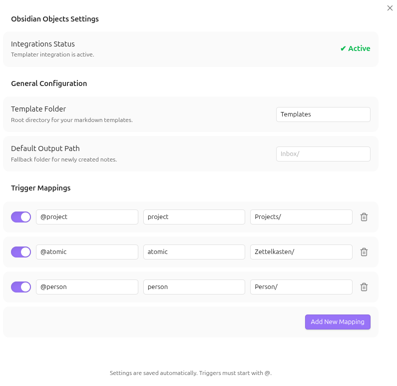
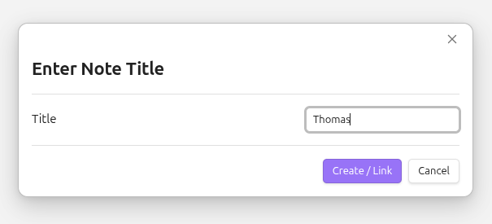

# 💎 Objects

> **Rethink your notes as objects.** Create structured, perfectly organized notes directly in your flow using simple `@-triggers`.

---

## Why Objects?

This plugin was built for a specific kind of note-taker: **The Obsidian Lover who misses Objects.**

If you've experimented with apps like **Anytype** or **Capacities** because you loved their object-oriented approach, but ultimately found yourself returning to the power, privacy, and flexibility of **Obsidian**, then this is for you. ❤️

**Objects** brings that missing piece to your vault. No more manual folder navigation or messy template applications—just pure, structured creation without leaving your keyboard.

  <figure>
    <video src="assets/Example.mp4" width="600" controls></video>
    <figcaption><i>See Objects in action</i></figcaption>
  </figure>

---

## What it does

**Objects** bridges the gap between thinking and documenting. Instead of breaking your creative flow to manually create files, navigate folders, or apply templates, you simply define "Objects" (like `@person`, `@meeting`, or `@atomic-note`) and trigger them anywhere.

- **Unified Workflow**: Creation, organization, and linking happen in one single interaction.
- **Smart Routing**: Notes are automatically moved to their designated folders based on their type.
- **Dynamic Content**: Uses a powerful fallback system (`{{title}}`, `{{date}}`, `{{time}}`) or integrates natively with [Templater](https://github.com/SilentVoid13/Templater).
- **Intelligent Linking**: If an object already exists, the plugin links to it instead of creating a duplicate.

---

## Preview

  <figure>
    
     
    <figcaption><i>1. Configure custom triggers and mappings</i></figcaption>
  </figure>
   
  <figure>
    
     
    <figcaption><i>2. Trigger with @ and select your object type</i></figcaption>
  </figure>
   
  <figure>
    
     
    <figcaption><i>3. Enter the name of your new object</i></figcaption>
  </figure>

---

## Try it out (Demo Vault)

To see **Objects** in action without configuring anything, check out our **Demo Vault**:

1.  Download the `demo/Objects-Demo-Vault` folder from this repository.
2.  Open Obsidian and select **"Open folder as vault"**.
3.  Choose the downloaded `Objects-Demo-Vault` folder.
4.  Open the `Welcome.md` file inside the vault for a quick guided tour.

The demo vault is pre-configured with sample templates, folders, and triggers to show you the power of object-oriented note-taking.

---

## How to use it

1.  **Trigger**: Type `@` (or your custom symbol) followed by the object type (e.g., `@project`) anywhere in your editor.
2.  **Identify**: A suggestion list appears—select your desired object.
3.  **Name**: A modal pops up. Type the name of your new object (e.g., "Deep Work Initiative").
4.  **Confirm**: Hit `Enter`.
5.  **Result**: A clean markdown link is inserted at your cursor, and the new note is instantly created in the background using your specified template.

> [!TIP]
> **Trigger Conflicts**: If the `@` symbol is already being used by other plugins (like *Mention* or *Calendar*), you can easily change the **Trigger symbol** in the plugin settings to something else, like `#` or `!`.

---

## Settings

Customize **Objects** to fit your personal knowledge management system:

| Setting | Description |
| :--- | :--- |
| **Path Configuration** | Set your global `Template Folder` and a `Default Output Path` for unassigned triggers. |
| **Trigger Mappings** | Map any `@trigger` (e.g., `@idea`) to a specific template and target folder. |
| **Status Check** | Real-time validation of your Templater integration. |

> **Note**: For full Templater syntax support, ensure **"Trigger Templater on new file creation"** is enabled in the Templater settings.

---

## Platform Support

Objects is primarily designed for **Desktop** environments to maximize productivity.

- **Tested on**: Linux, Android (Mobile)
- **Untested but likely compatible**: macOS, Windows, iOS

*Feel free to test it on your platform and report any issues!*

---

## Installation

### Via Obsidian (Recommended once released)
1. Open **Settings** > **Community Plugins**.
2. Click **Browse** and search for `Objects`.
3. Click **Install**, then **Enable**.

### Via BRAT (For Beta Testing)
1. Install the [BRAT plugin](https://github.com/TfTHacker/obsidian42-brat) from the Community Plugins store.
2. Open **Settings** > **BRAT**.
3. Click **Add Beta Plugin**.
4. Paste the URL of this repository: `https://github.com/Finn-Kraemer/obsidian-objects` or `Finn-Kraemer/obsidian-objects`
5. Click **Add Plugin** and then enable **Objects** in your Community Plugins settings.

### Manual Installation
1. Download the `main.js` and `manifest.json` from the [latest release](https://github.com/Finn-Kraemer/obsidian-objects/releases).
2. Create a folder named `obsidian-objects` in your vault's `.obsidian/plugins/` directory.
3. Move the downloaded files into that folder.

---

## 📄 License

This project is licensed under the **MIT License**. See the [LICENSE](./LICENSE) file for details.
